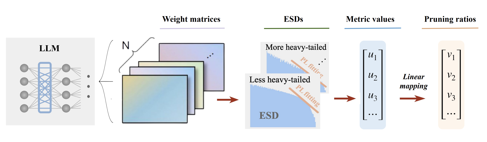

#  AlphaPruning: Using Heavy-Tailed Self Regularization Theory for Improved Layer-wise Pruning Large Language Models

[Haiquan Lu](https://haiquanlu.github.io/), [Yefan Zhou](https://yefanzhou.github.io/), [Shiwei Liu](https://shiweiliuiiiiiii.github.io/), [Zhangyang "Atlas" Wang](https://vita-group.github.io/research.html), [Michael W. Mahoney](https://www.stat.berkeley.edu/~mmahoney/), [Yaoqing Yang](https://sites.google.com/site/yangyaoqingcmu/)

**Nankai University, Dartmouth College, University of Oxford, University of Texas at Austin, University of California at Berkeley.**

[Full paper](https://www.arxiv.org/pdf/2410.10912)



## Abstract
Recent work on pruning large language models (LLMs) has shown that one can eliminate a large number of parameters without compromising performance, making pruning a promising strategy to
reduce LLM model size. Existing LLM pruning strategies typically assign uniform pruning ratios across layers, limiting overall pruning ability; and recent work on layerwise pruning of LLMs is often based on heuristics that can easily lead to suboptimal performance. In this paper, we leverage Heavy-Tailed Self-Regularization (HT-SR) Theory, in particular the shape of empirical spectral densities (ESDs) of weight matrices, to design improved layerwise pruning ratios for LLMs. Our analysis reveals a wide variability in how well-trained, and thus relatedly how prunable, different layers of an LLM are. Based on this, we propose AlphaPruning, which uses shape metrics to allocate layerwise sparsity ratios in a more theoretically-principled manner. AlphaPruning can be used in conjunction with multiple existing LLM pruning methods. Our empirical results show that AlphaPruning prunes LLaMA-7B to 80% sparsity while maintaining reasonable perplexity, marking a first in the literature on LLMs.

## Update
- [x] (12.7.2024) We released the code for AlphaPruning.
- [x] (12.7.2024) Add code for [LoRA fine-tuning](lora_ft).
- [x] (12.28.2024) Add code for [Image_classifiers](image_classifiers).
- [x] (6.9.2025) New paper [Eigenspectrum Analysis of Neural Networks without Aspect Ratio Bias](https://arxiv.org/pdf/2506.06280) is on Arxiv.

## Installation
Environment setup instructions can be found in [INSTALL.md](INSTALL.md).

Download pre-computed metric values for `LLaMa-V1 and LLaMa-V2 models` ([Link](https://drive.google.com/drive/folders/17JbO5P4-Qfhl4i0K0MoCBLvHdM4DqoFh?usp=drive_link)) and save to ./data folder.

## Usage
The [scripts](scripts) directory contains all the bash commands to replicate the main results (Table 2) in our paper.

Below is an example command for pruning Llama-2-7B using Wanda with our layerwise pruning ratios, to achieve unstructured 70% sparsity.
```sh
python  main.py \
    --model meta-llama/Llama-2-7b-hf \
    --cache_dir llm_weights/ \
    --prune_method wanda_ww \
    --sparsity_ratio 0.7 \
    --save results/ \
    --ww_metric alpha_peak \
    --ww_metric_cache ./data/llama2-7b-hf/ \
    --epsilon 0.3
```
We provide a quick overview of the arguments:  
- `--model`: The identifier for the LLaMA model on the Hugging Face model hub.
- `--cache_dir`: Directory for loading or storing LLM weights. The default is `llm_weights`.
- `--prune_method`: We have implemented these pruning methods, namely [`magnitude`, `wanda`, `sparsegpt`, `magnitude_ww`, `wanda_ww`, `sparsegpt_ww`].
- `--sparsity_ratio`: Denotes the percentage of weights to be pruned.
- `--save`: Specifies the directory where the result will be stored.
- `--ww_metric`: The ESDs metric used to diagnose layer quality and assign layer-wise pruning ratios. The default is `alpha_peak`.
- `--ww_metric_cache`: Directory for loading the layer-wise metric value of the model before pruning.
- `--epsilon`: Denotes the hyperparameter to control the range of pruning ratios. 

**To prune other LLMs, you can change the "model" argument in the script.**

## Zero-shot Evaluation
Following [Wanda](https://github.com/locuslab/wanda?tab=readme-ov-file), we use the modified EleutherAI LM Harness framework to evaluate pruned LLM models. We provide the modified repo in this [link](https://drive.google.com/drive/folders/1-izPsaOAiatn6YJYGQD_PlzfPIdBoLBI?usp=drive_link). Make sure to download, extract and install this custom lm_eval package from the source code.

On a high level, the functionality is adding two arguments `pretrained_model` and `tokenizer` in this [function](https://github.com/EleutherAI/lm-evaluation-harness/blob/master/lm_eval/evaluator.py#L17). We can then call this `simple_evaluate` function API from the codebase to evaluate sparse pruned LLMs. To evaluate zero-shot tasks in addition to the WikiText perplexity, pass the --eval_zero_shot argument in the scripts.

## Speedup Evaluation
We evaluate CPU-Acceleration using DeepSparse CPU inference engine.

**Step1: install relevant packages [sparseml](https://github.com/neuralmagic/sparseml) and [deepsparse](https://github.com/neuralmagic/deepsparse)**

**Step2: create sparse model checkpoint, and save to model_path**

**Step3: export the sparse checkpoint to ONNX format**
```
sparseml.export --task text-generation model_path
```

**Step4: evaluate using deepsparse**
```
deepsparse.benchmark model_path/deployment/model.onnx --sequence_length 2048
```

## Lora Finetuning
We provide the code for the lora fine-tuning experiments in [lora_ft](lora_ft).

To train a LoRA adapter, run the command:
```sh
CUDA_VISIBLE_DEVICES=0 python lora_ft/finetune_lm.py \
    --model_name_or_path [PATH to load sparse pruned LLaMA-7B] \
    --config_name "meta-llama/Llama-2-7b-hf" \
    --dataset_name c4 \
    --num_train_epochs 1 \
    --block_size 2048 \
    --per_device_train_batch_size 1 \
    --per_device_eval_batch_size 8 \
    --do_train \
    --do_eval \
    --max_train_samples 100000 \
    --max_eval_samples 128 \
    --learning_rate 1e-4 \
    --overwrite_output_dir \
    --output_dir [PATH to save the LoRA weights]
```
We provide a quick overview of the arguments:  
- `--model_name_or_path`: The path/directory where pruned LLaMA-7B are saved with `model.save_pretrained(PATH)`.
- `--block_size`: context size;
- `--max_train_samples`: the number of training sequences;
- `--learning_rate`: the learning rate for LoRA fine-tuning;

We also provide the code to evaluate LoRA adapter on WikiText validation dataset in [lora_ft/evaluate_ppl.py](lora_ft/evaluate_ppl.py). For zero shot evaluation, additionally pass the `--eval_zero_shot` argument.

## Image Classifiers
For pruning image classifiers, see directory [image_classifiers](image_classifiers) for details, where we provide the code for pruning ConvNeXt and ViT.

## Citation
We would appreciate it if you could cite the following paper if you found the repository useful for your work:

```bash
@inproceedings{lu2024alphapruning,
title={AlphaPruning: Using Heavy-Tailed Self Regularization Theory for Improved Layer-wise Pruning of Large Language Models},
author={Lu, Haiquan and Zhou, Yefan and Liu, Shiwei and Wang, Zhangyang and Mahoney, Michael W and Yang, Yaoqing},
booktitle={Thirty-eighth Conference on Neural Information Processing Systems},
year={2024}
}
```

## Acknowledgement
This repository is build upon the [Wanda](https://github.com/locuslab/wanda/tree/main) and [TempBalance](https://github.com/YefanZhou/TempBalance/tree/main) repository.

## License
This project is released under the MIT license. Please see the [LICENSE](LICENSE) file for more information.
